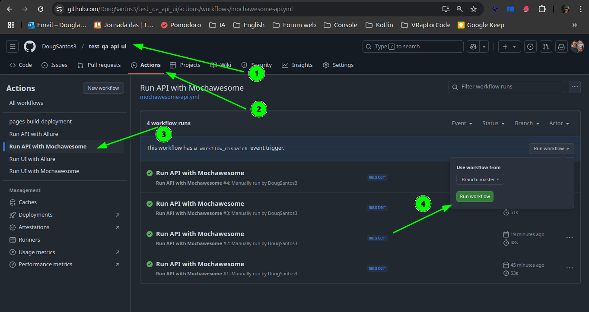

<h1 align="center">Automation with Cypress on ServeRest</h1>
<br />

[](https://sonarcloud.io/summary/new_code?id=DougSantos3_test_qa_api_ui)
[](https://sonarcloud.io/summary/new_code?id=DougSantos3_test_qa_api_ui)
[](https://sonarcloud.io/summary/new_code?id=DougSantos3_test_qa_api_ui)

</p>
</div>

<br>
<br>

This is a Test QA - project using [`cypress`](https://www.cypress.io/).

## Getting Started

You need to download the packages:

```bash
# Node
v20.18.0 lts
```

```bash
# Npm version: 11.0.0 and Download dependencies
npm install
```

Run tests:

```bash
# Open dashboard cypress
npm run open
```

```bash
# Run tests ui env qa
npm run test:ui-mochawesome
```

```bash
# Run tests api env qa
npm run test:api-mochawesome
```

```bash
# After run test, create report. Use this command if you want to merge the json 
npm run mochawesome:merge
```

```bash
# After with this command you will create the html with all the reports
npm run mochawesome:generate
```


#### A mochawesome-report folder will be generated in the project root and you must enter it, look for the merged.html file where the report with the scenarios will be, just double-click on it.

#### The system only has one environment where I left qa as default, but if the system has multiple environments, you just need to change the urls in cypress.config.js and call it via:

#### NODE_ENV=dev npm run test:ui-mochawesome

#### or

#### NODE_ENV=prod npm run test:ui-mochawesome

<br>

## Tests Overview

### API Tests

- Updating the user's email
- Shopping cart registration
- Removing a product
- Searching for a product
- Searching for a user (This last one includes a test for user search and also validates the API contract within the same test)

### UI Tests

- Product creation
- User creation
- Login

<br>


### Run GitHub Action
`Api`

<p align="center">
  
</p>

<p align="center">
  
</p>


`Ui`
<p align="center">
  
</p>

`Ui`
<p align="center">
  
</p>


# Important

The local allure and mochawesome report works but the remote one is in(progress)

## Learn More

From the test application I have my postman collection with more automated scripts than the one that comes in the serverRest repository.

colletion_postman/myCollection.postman_collection.json
<br>
colletion_postman/postman_environment.json

<br>


## Project that was tested

To learn more repository serveRest:

- Project tested UI [Serverest](https://front.serverest.dev/login)
- Project tested API [Serverest](https://serverest.dev/#/)
- [Repository ServeRest](https://github.com/ServeRest/ServeRest)


<br>

## More information

If you need to use automation to access the development database in scenarios where, after the automated test, the saved record needs to be deleted to avoid accumulating entries (since the automation handles this), or if you need to perform a SELECT to retrieve data for testing purposes or other scenarios, the project is already preconfigured to access the database. It even includes examples of queries within the commands file located at cypress/support/commands/database-commands.js.
